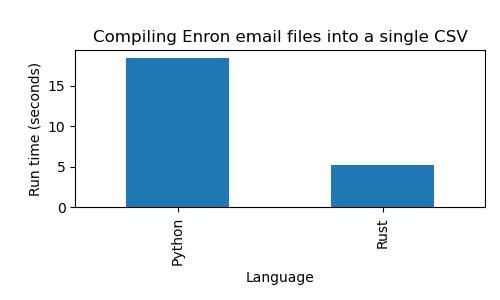
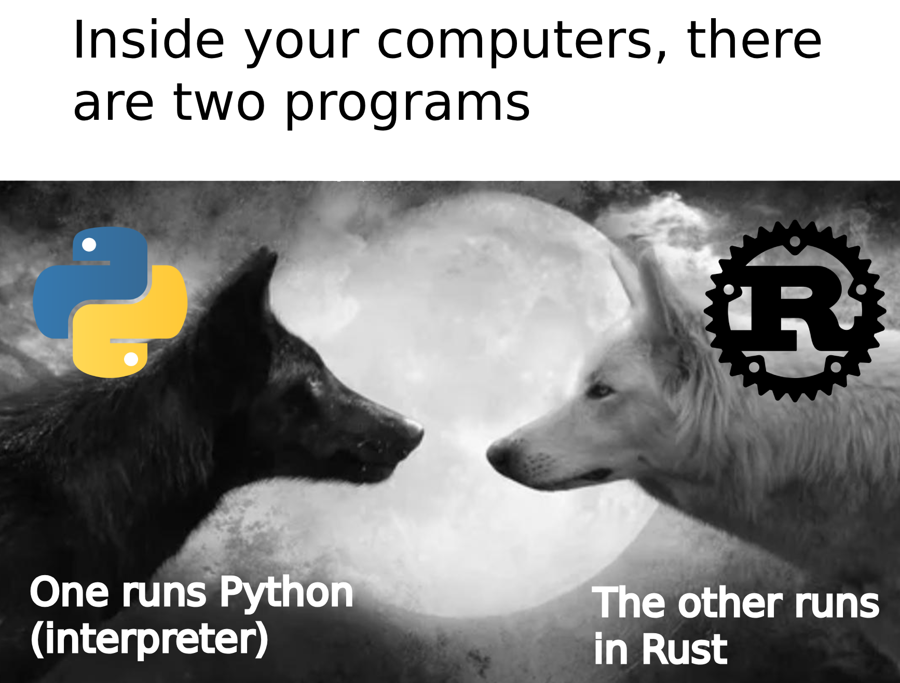
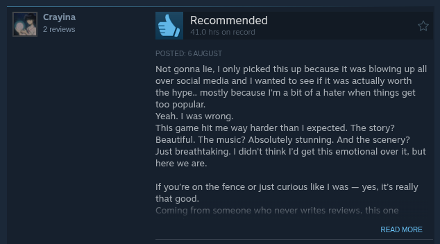
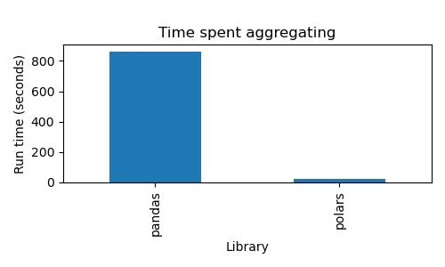
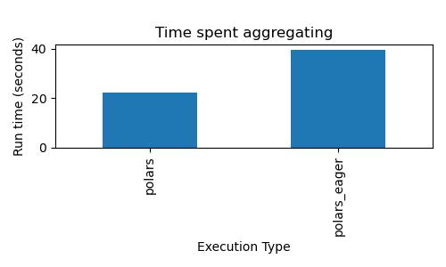
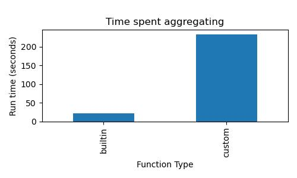

<!-- _class: lead -->

# Fast Data Processing

# (A Disguised Polars Ad)

---

# Agenda

- Why should you care about processing data faster?
- Different ways to speed up data processing
- Why you should use Polars
- A few other things you can do apart from Polars

---

# Why should you care?

- Cost
- Faster code means faster iteration
- Less stress and anxiety

---

# Why should you care?

- Cost
- Faster code means faster iteration
- Less stress and anxiety
- Bragging rights 😎🔥💯👑

---

# Different ways to speed up data processing

---

# Different ways to speed up data processing

- Buy a faster computer / more computers

---

# Different ways to speed up data processing

- Buy a faster computer / more computers
- Change to a faster language

---

## Change to a faster language


an unscientific ranking by Dr. Piti Ongmongkolkul (my physics(??????) professor)

---

## Change to a faster language

**Goal**: Combine all file contents and path into a single CSV file
**Data size**: 517k+ files

```
├── allen-p
│   ├── all_documents
│   │   ├── 1.  <--- these are email files
│   │   ├── 10.
│   │   ├── 100.
│   │   ├── 101.
│   │   ├── 102.
│   │   ├── 103.
│   │   ├── 104.
```

---

## Change to a faster language



---

# Different ways to speed up data processing

- Buy a faster computer / more computers
- Change to a faster language
- Use Polars :)

---

# Why should you use Polars?

- Python library with Rust back-end
- Faster than Pandas due to out-of-the-box parallelism
- Supports lazy evaluation
- Syntax
  - analogous to SQL
  - better data typing
  - more built-in functions

---

## Python library with Rust back-end



---

## Faster than Pandas with out-of-the-box parallelism

- Multi-threaded/ing means using multiple CPUs
- Pandas is single-threaded out-of-the-box
  - DIY with `multiprocessing`
  - Pandas-like APIs with Modin or Dask for multi-threading support
- Polars is already multi-threaded

---

## Faster than Pandas with out-of-the-box parallelism

**Goal**: Find out the following for each game from the [Steam Game Reviews](https://www.kaggle.com/datasets/najzeko/steam-reviews-2021)
**Data size**: ~21M reviews

- percentage of players who recommends the game
- average all-time play time of all reviewers
- most used word (English reviews only)

---

## Faster than Pandas with out-of-the-box parallelism



---

## Faster than Pandas with out-of-the-box parallelism



---

## Supports lazy evaluation

Polars can do behind-the-scenes optimizations for you
- Run filters before the rest of the processing
- Don't load the columns/fields you don't need (for some file types)

---

## Supports lazy evaluation



---

## Syntax - Analogous to SQL

```python
people_data_lf.filter(pl.col("age") >= 20 & pl.col("age") < 30)
.select(  # or .with_columns
  pl.col("person_name").str.to_uppercase().alias("upper_name"),
  (pl.col("height") * pl.col("arm_span")).alias("rectangle"),
)
```

```sql
SELECT
  UPPER(person_name) AS upper_name,
  height * arm_span AS rectangle
FROM people_data
WHERE
  age >= 20 AND age < 30
```

---

## Syntax - Analogous to SQL

```python
people_data_with_computed_lf.group_by("age")
.agg(
  pl.col("rectangle").max(),
  pl.col("rectangle").min(),
  pl.col("rectangle").mean(),
)
```

```sql
SELECT
  MAX(rectangle),
  MIN(rectangle),
  AVG(rectangle)
FROM people_data_with_computed
GROUP BY age
```

---

## Syntax - Better data typing

- Polars has stricter typing
- Better null-handling
- Polars' nested types `Struct` or `List` vs. Pandas' `object`
- Gives more clarity when coding

---

## Syntax - More built-in functions

A few examples:
- Functions for handling nested types 
  - `.unnest` on `Struct` fields
  - `.explode` on `List` types
- Aggregation with `mode` (most common element of collection)

---

## Syntax - More built-in functions

```python
lf.with_columns(
  review=pl.col("review").str.to_lowercase()
  .str.split(" ").list.filter(~pl.element().is_in(WORDS_TO_IGNORE))
)
.group_by(["game_name"])
.agg(most_common_word=pl.col("review").flatten().mode().first())
```

---

## Syntax - More built-in functions

```python
from collection import Counter

def _get_most_common_word(agg_words: pd.Series) -> str:
  counter = Counter([word for words in agg_words for word in words])
  return counter.most_common(1)[0][0]

df["review"] = df["review"].map(
  lambda strings: [word for word in strings if word not in WORDS_TO_IGNORE]
  if (isinstance(strings, list))
  else [],
)
df = df.groupby("game_name").agg({"review": _get_most_common_word})
```

---

## What if I still don't wanna use Polars? Pandas are cuter! 😠

---

## What if I still don't wanna use Polars? Pandas are cuter! 😠

Wrong. Polar bears are cuter than pandas!!

| Polars                                      | Pandas                                       |
| ------------------------------------------- | -------------------------------------------- |
|  |  |

---

# A few more tool-agnostic tricks

- Built-in functions are good, use them
- Loops are evil, use joins

---

## Built-in functions are good, use them

```python
important_fields_lf.with_columns(
  review=pl.col("review").str.to_lowercase()
  .str.split(" ").list.filter(~pl.element().is_in(WORDS_TO_IGNORE))
)
.group_by(["game_name"])
.agg(most_common_word=pl.col("review").flatten().mode().first())
.select([pl.col("game_name"), pl.col("most_common_word")])
```

---

## Built-in functions are good, use them

```python
def process_review_str(review: str) -> list[str]:
  split_word = review.lower().split(" ")
  filtered_words = [word for word in split_word if word not in WORDS_TO_IGNORE]
  return filtered_words

def aggregate_reviews(all_review_words: list[list[str]]) -> Optional[str]:
  flat_words = [word for review_words in all_review_words for word in review_words]
  counter = Counter(flat_words)
  most_common_words = counter.most_common(1)
  return most_common_words[0][0] if len(most_common_words) > 0 else None

processed_lf = (
  important_fields_lf.with_columns(
    review=pl.col("review").map_elements(process_review_str, return_dtype=pl.List(String))
  )
  .group_by(["game_name"])
  .agg(most_common_word=pl.col("review").map_elements(aggregate_reviews, return_dtype=pl.String))
  .select([pl.col("game_name"), pl.col("most_common_word")])
)
```

---

## Built-in functions are good, use them



---

## Loops are evil, use joins

Loop version:
```python
for row1 in lf1.iter_rows:
  for row2 in lf2.iter_rows:
    if row1.id == row2.id:
      ...
```

Join version (in Polars):
```python
lf1.join(lf2, on="id").with_columns(...)
```

---

## Loops are evil, use joins

Loop version:
```python
for row1 in lf1.iter_rows:
  for row2 in lf2.iter_rows:
    if row1.start_time <= row2.event_time <= row1.end_time:
      ...
```

Join version (in Polars):
```python
lf1.join(lf2, how="cross").filter(
  pl.col("lf1_start_time") <= pl.col("lf2_event_time") <= pl.col("lf1_end_time")
).with_columns(...)
```

---

# Conclusion

---

# Conclusion

- How do you process data fast? Depends :D

---

# Conclusion

- How do you process data fast? Depends :D
- Should you use Polars? Depends :D

---

# Conclusion

- How do you process data fast? Depends :D
- Should you use Polars? Depends :D
- Will Polars get you closer to Nagoya 2026? Depends :DDD

---

# One more thing...

---

# One more thing... DuckDB!

- Comparable performance with Polars
- SQL-based
- Ducks are cute :)

---

# Please use Polars!!


---

# Polars Crash Course


---

# Polars Crash Course

| YouTube tutorial style | Conference demo style |
|----------------------------------------------------------------|------------------------------------------------------------------|
|||

---

<!-- _class: lead -->

# Thank you!
