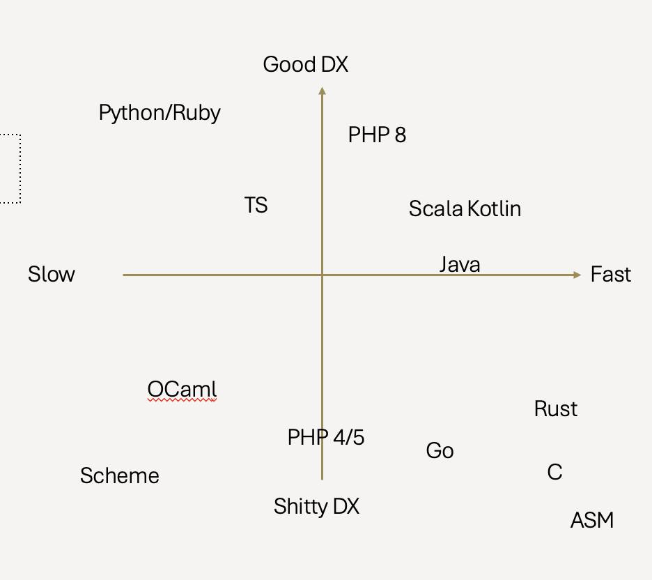

<!-- _class: lead -->

# Fast Data Processing

# (A Disguised Polars Ad)

---

# Agenda

- Why should you care about processing data faster?
- Different ways to speed up data processing
- Why you should use Polars

---

# Why should you care?

- Faster code means faster iteration
- Less stress and anxiety

---

# Why should you care?

- Faster code means faster iteration
- Less stress and anxiety
- Bragging rights 😎🔥💯👑

---

# Different ways to speed up data processing

---

# Different ways to speed up data processing

- Buy a faster computer / more computers

---

# Different ways to speed up data processing

- Buy a faster computer / more computers
- Change to a faster language

---

an unscientific ranking by Dr. Piti Ongmongkolkul (my physics(??????) professor)

---

# Different ways to speed up data processing

- Buy a faster computer / more computers
- Change to a faster language
- Use Polars :)

---

# Why should you use Polars?

- Out-of-the-box parallelism
- Syntax
  - analogous to SQL
  - encourages a style of programming that works well with parallelism
- Supports lazy evaluation

---

# What if I don't wanna use Polars? Pandas are cuter! 😠

---

# What if I don't wanna use Polars? Pandas are cuter! 😠

Wrong. Polar bears are cuter than pandas!!

---

| Polars                                      | Pandas                                       |
| ------------------------------------------- | -------------------------------------------- |
|  |  |

---

## Out-of-the-box parallelism

---

# A few more language-agnostic tricks

- Built-in APIs are good
- Loops are evil

---

# Conclusion

---

<!-- _class: lead -->

# Thank you!
